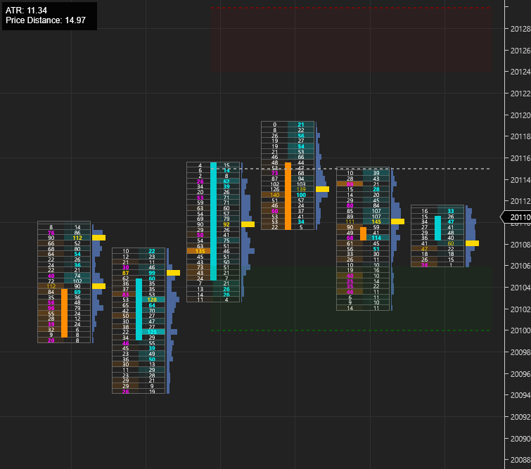

# Open Auto ATR (Average True Range)

    

Open Auto ATR displays the median ATR for the last `Median Period`. It will auto update once the high or low of the median ATR breaks. The idea is to play the range or break out and help increase risk/reward ratios.

For usage, you can download the zip containing the word import in the release page. You can import this zip file similar to importing a normal NinjaTrader Add-On. https://github.com/WaleeTheRobot/open-auto-atr/releases

# Trade Ideas

- Use the high, low or median lines as targets or stops
- Play reversion from the upper and lower ranges
- Play breakouts from high and low

# Properties

- ATR - The ATR period.
- ATR Multiplier - The mulltiplier used with the ATR to calculate the prices.
- Median Period - Used to calculate the ATR for last x number of bars.
- Fixed Length - The length of the lines.
- Right Offset - The offset for the lines from the right.
- Range Percentage - The range for the upper and lower ranges.
- Line Opacity - The opacity for the lines.
- Range Opacity - The opacity for the ranges.
- High Color - The color of the high line.
- Median Color - The color of the median line.
- Low Color - The color of the low line.
- Upper Range Color - The color of the upper range.
- Lower Range Color - The color of the lower range.
